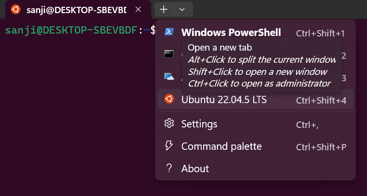

# How to install WSL with ubuntu 22.04 distro in windows 11

> [!NOTE]
> You must be running Windows 10 version 2004 and higher (Build 19041 and higher) or Windows 11 to use the commands below
> [!IMPORTANT]
> Memory & Storage: Minimum 4GB RAM (8GB recommended) and 10GB+ free storage.

1. Open powershell with Run as Administrator

Run the below command to install wsl

```bash
wsl --install
```

2. You may be prompted to grant permission to continue the installation.

3. You may also need to reboot your machine before installing and running any Ubuntu distro.

4. In a PowerShell terminal, run the below command to see a list of all available distros and versions:

```bash
wsl --list --online
```

```
The following is a list of valid distributions that can be installed.
Install using 'wsl.exe --install <Distro>'.

NAME                            FRIENDLY NAME
Ubuntu                          Ubuntu
Ubuntu-24.04                    Ubuntu 24.04 LTS
openSUSE-Tumbleweed             openSUSE Tumbleweed
openSUSE-Leap-16.0              openSUSE Leap 16.0
SUSE-Linux-Enterprise-15-SP7    SUSE Linux Enterprise 15 SP7
SUSE-Linux-Enterprise-16.0      SUSE Linux Enterprise 16.0
kali-linux                      Kali Linux Rolling
Debian                          Debian GNU/Linux
AlmaLinux-8                     AlmaLinux OS 8
AlmaLinux-9                     AlmaLinux OS 9
AlmaLinux-Kitten-10             AlmaLinux OS Kitten 10
AlmaLinux-10                    AlmaLinux OS 10
archlinux                       Arch Linux
FedoraLinux-43                  Fedora Linux 43
FedoraLinux-42                  Fedora Linux 42
eLxr                            eLxr 12.12.0.0 GNU/Linux
Ubuntu-20.04                    Ubuntu 20.04 LTS
Ubuntu-22.04                    Ubuntu 22.04 LTS
OracleLinux_7_9                 Oracle Linux 7.9
OracleLinux_8_10                Oracle Linux 8.10
OracleLinux_9_5                 Oracle Linux 9.5
openSUSE-Leap-15.6              openSUSE Leap 15.6
SUSE-Linux-Enterprise-15-SP6    SUSE Linux Enterprise 15 SP6
```

5. Install a specific Ubuntu distro using a NAME from the output.

```bash
wsl --install Ubuntu-22.04
```

### Start an Ubuntu instance

> [!NOTE]
> During installation of an Ubuntu distro on WSL, you are asked to create a username and password specific to that instance. This also starts an Ubuntu session and logs you in.

1. Opening the dropdown in Windows Terminal



WSL should be installed in your windows.

Reference 

:link: [Ubuntu on WSL](https://documentation.ubuntu.com/wsl/stable/howto/install-ubuntu-wsl2/#install-ubuntu-on-wsl-2)